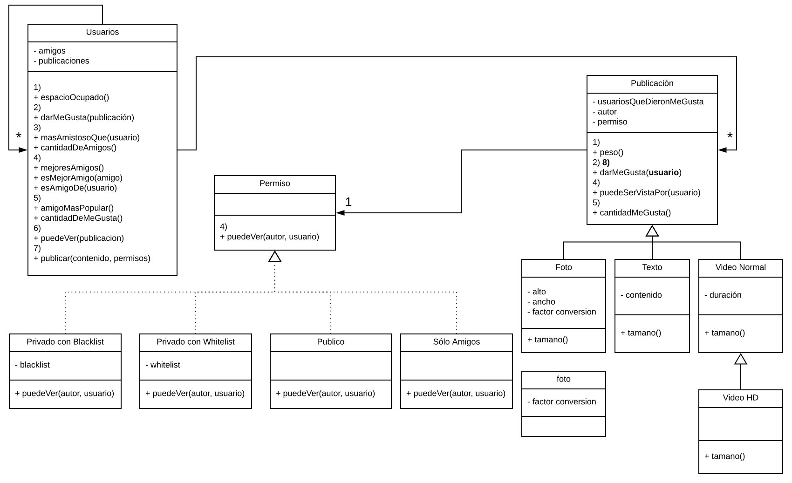

# Ejercicio Faceless

[Enunciado](https://docs.google.com/document/d/1MaUsCwzYpggOCVGI6jlg_7KiUQ0WbZsWDO8OCQ1NYNc/edit?usp=sharing)

## Diagrama de Clases

## Resolución en Wollok

[Faceless.wlk](https://github.com/pdep-sm/ejercicio-faceless/blob/master/src/faceless.wlk)
